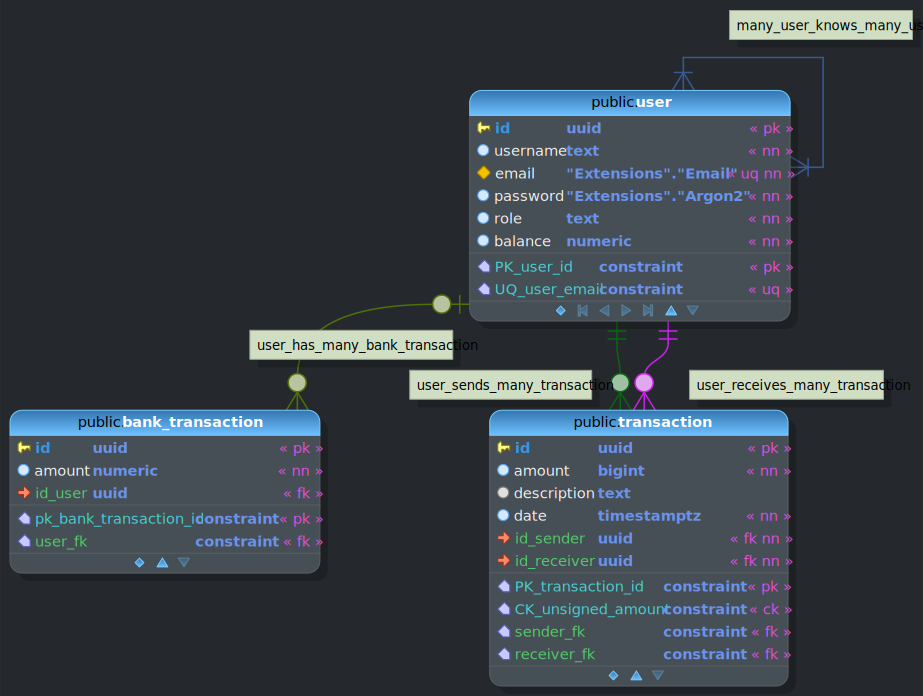
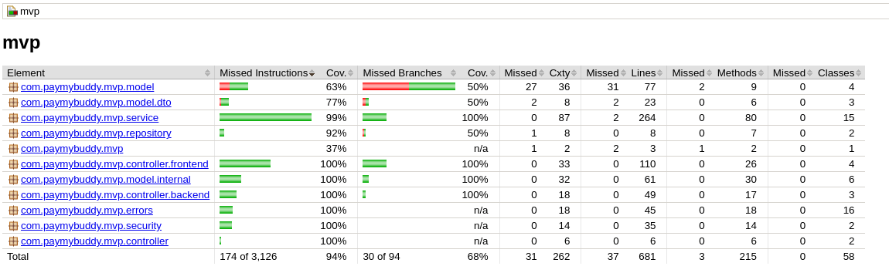
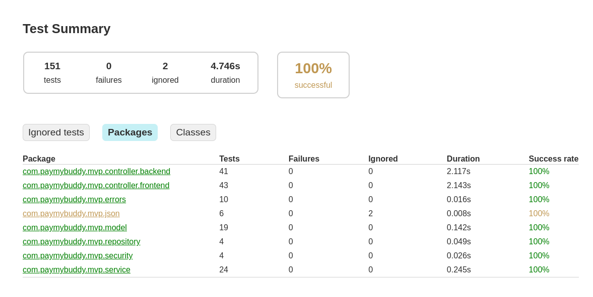
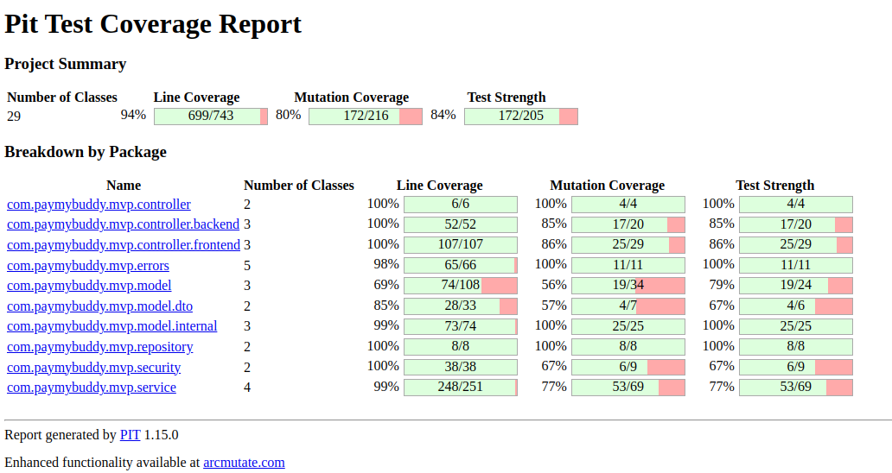

# Pay My Buddy

<div align="center">
    
</div>

PayMyBuddy enables the sharing of real world currency between users in a simple, fast, and secure manner.

## Table of contents

- [Pay My Buddy](#pay-my-buddy)
  - [Table of contents](#table-of-contents)
  - [Tech stack](#tech-stack)
    - [Database](#database)
    - [Backend](#backend)
    - [Frontend](#frontend)
  - [Running the application](#running-the-application)
    - [Gradle](#gradle)
    - [Container](#container)
  - [Database schema](#database-schema)
  - [Testing](#testing)
    - [Coverage](#coverage)
    - [Test execution](#test-execution)
    - [Mutation](#mutation)

## Tech stack

### Database

- [PostgreSQL](https://www.postgresql.org/): SQL database.
- [SQLx](https://github.com/launchbadge/sqlx): Simple SQL migration.

### Backend

- [Gradle](https://gradle.org/): Integrated build tool with `gradlew`.
- [Java](https://www.java.com/en/) >=21.
- [Spring boot](https://spring.io/projects/spring-boot): Configure a Spring project.

### Frontend

- [Thymeleaf](https://www.thymeleaf.org/): Java templating engine.
- [TailwindCSS](https://tailwindcss.com/): CSS framework.

## Running the application

There are 2 different way to run this application:

### Gradle

Run the tests using:

```sh
./gradlew test
```

Run the mutation tests using:

```sh
./gradlew pitest
```

Build the application as an uber JAR (a JAR containing all of its dependencies) using:

```sh
./gradlew bootJar
java -jar build/**.jar # Run
```

Run the application using:

```sh
cp .env.CHANGEME .env
# Edit the `DATABASE_**` variables to match your PostgreSQL instance
curl --proto '=https' --tlsv1.2 -sSf https://sh.rustup.rs | sh # Install Rust, used to install the migration tool
cargo install sqlx-cli
sqlx database setup
./gradlew bootRun
```

### Container

You can run the application using an [OCI compliant container engine](https://en.wikipedia.org/wiki/Open_Container_Initiative) (like [Docker](https://www.docker.com/) or [Podman](https://podman.io/)) that supports the [compose specification](https://compose-spec.io/).

```sh
# Using Docker
docker-compose up -d
# Using Podman
podman-compose up -d
```

## Database schema



## Testing

This application was tested on a Linux machine (Ubuntu 24.10 x86_64).

### Coverage



### Test execution



### Mutation


